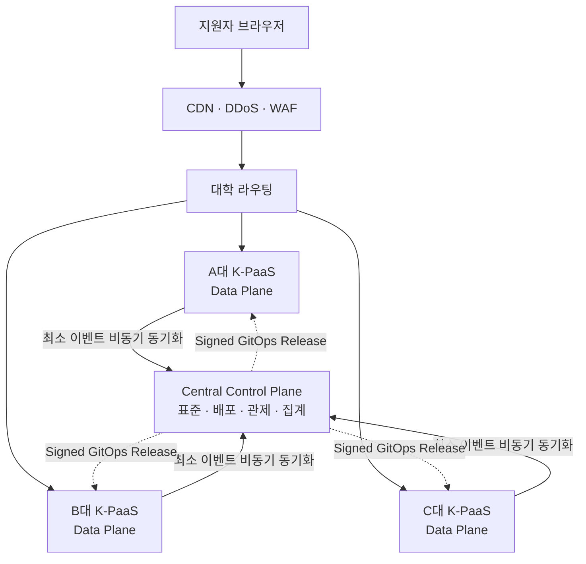
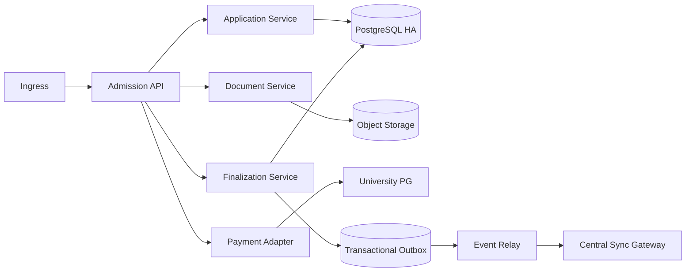
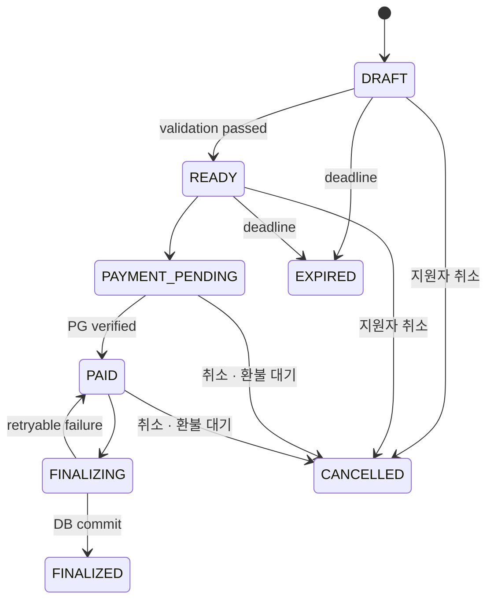

<p align="center">
  <a href="#overview">
    
  </a>
</p>

<p align="center">
  <strong>표준과 편의는 하나로, 장애와 접수는 대학별로.</strong><br />
  <sub>K-PaaS 기반 분산형 대학입학 원서접수 표준 플랫폼</sub>
</p>

<p align="center">
  <a href="#overview"><strong>Overview</strong></a> ·
  <a href="#architecture"><strong>Architecture</strong></a> ·
  <a href="#reliability--security"><strong>Reliability &amp; Security</strong></a> ·
  <a href="#roadmap"><strong>Roadmap</strong></a>
</p>

<p align="center">
  
  
  
  
  
  
</p>

## Overview

**원서로(Wonseoro)** 는 대학입학 원서접수의 편의성은 통합하되, 접수에 필요한 핵심 트래픽과 원본 데이터를 대학별 독립 환경으로 분산하는 **Federated Admission Platform**입니다. 기술 설계명은 **K-Admission**입니다.

기존의 단일 중앙 접수 구조에서는 하나의 장애가 여러 대학의 마감 업무로 전파될 수 있습니다. 원서로는 공통원서, 대학 검색, 통합 상태 조회 같은 편의 기능은 중앙에서 제공하면서도 자동저장, 대학별 추가정보, 서류, 결제 검증, 최종 접수와 접수번호 발급은 대학별 K-PaaS Data Plane에서 처리합니다.

> **Architecture Statement**  
> Compute는 대학에, Control은 중앙에, Standard는 공통 규격에, 개인정보 원본은 대학 경계 안에 둡니다.

### 해결하려는 문제

| 문제 | 원서로의 접근 |
| --- | --- |
| 마감 직전 트래픽이 한곳에 집중 | Write 트래픽과 최종 접수를 대학별 Data Plane으로 분산 |
| 중앙 장애가 여러 대학으로 확산 | 중앙 Control Plane을 접수 Critical Path에서 제외 |
| 결제 성공과 접수 상태가 모호 | Payment와 Submission 상태를 분리하고 서버가 PG 결과를 재검증 |
| 장애 이후 접수 의사 확인이 어려움 | 저장·결제·제출 전 과정을 불변 Audit Timeline으로 기록 |
| 대학별 인프라·운영역량 차이 | Self-Hosted부터 Fully Managed Dedicated까지 동일한 격리 원칙 제공 |
| 중앙 개인정보 집중 | 필요한 필드만 동의 기반으로 대학에 Snapshot 전달 |

## Design Principles

| 원칙 | 설계 기준 |
| --- | --- |
| **대학별 장애 격리** | 한 대학의 장애가 다른 대학의 접수에 전파되지 않습니다. |
| **중앙 비의존성** | 중앙이 중단돼도 이미 시작된 대학 원서의 작성·결제·접수는 계속됩니다. |
| **대학 DB 원장** | 최종 접수 여부의 System of Record는 각 대학 Data Plane의 DB입니다. |
| **표준화된 실행환경** | K-PaaS/Kubernetes, OCI, Helm, GitOps로 설치 차이를 줄입니다. |
| **Privacy by Design** | 원서 본문과 고위험 개인정보는 원칙적으로 대학 경계를 벗어나지 않습니다. |
| **Fail-safe Finalization** | 재시도에도 중복 접수가 발생하지 않고 모든 중요 상태 변경을 증명할 수 있어야 합니다. |
| **Web First** | 별도 플러그인 없이 표준 브라우저와 접근성 기준을 통해 전체 절차를 완료합니다. |

## Architecture



### Central Control Plane

중앙은 지원자 요청의 Critical Path에 들어가지 않습니다.

- 대학·도메인·전형연도를 관리하는 University Registry
- Data/Event Schema와 호환성을 관리하는 Schema Registry
- 서명된 이미지, Helm Chart, SBOM을 관리하는 Release Registry
- 대학별 정책과 설정을 Pull 방식으로 전달하는 GitOps Control
- 최소화된 최종접수 이벤트를 검증·중복 제거하는 Sync Gateway
- 개인정보를 제거한 SLO, 보안 신호, DR 상태를 통합하는 관제 계층

### University Data Plane

각 대학은 독립된 Runtime, DB, Storage와 장애 경계를 유지합니다.



## Applicant Journey

지원자에게는 인프라가 분산되어 있다는 복잡성을 노출하지 않습니다.

```text
공통정보 작성
  → 대학·전형 선택
  → 대학별 추가정보·서류
  → 최종 원서 검토
  → 전형료 결제 및 자동 접수 완료
  → 접수번호·접수증 확인
```

- 입력 내용은 자동 저장되고 마지막 저장 시각과 실패 여부를 항상 표시합니다.
- 마감시간은 브라우저 시간이 아닌 서버 시간을 기준으로 판단합니다.
- 오류가 발생해도 유효한 입력값은 보존하며, 색상뿐 아니라 텍스트와 아이콘으로 상태를 전달합니다.
- 키보드만으로 전체 접수를 완료할 수 있도록 KWCAG 2.2와 KRDS 기반 UI를 목표로 합니다.

## Finalization

최종 접수는 가장 강한 정합성이 필요한 경로입니다. 중앙 동기화, 접수증 PDF, 문자·메일 발송은 대학 DB Commit 이후 비동기로 처리합니다.



`FINALIZED`는 종착 상태입니다. 접수 원장(Submission)을 고쳐 쓰면 "무엇이 접수되었는가"에 답할 수 없고, 감사 해시체인과 증적 재구성이 서 있는 전제가 무너지기 때문입니다. 접수 완료 후의 취소는 상태를 덮는 것이 아니라 별도 기록으로 다루어야 하며, 현재는 입학처 문의로 안내합니다. `FINALIZING` 중에도 취소하지 않습니다 — 취소와 커밋이 경합하면 "취소했는데 접수됨"이 생깁니다.

확정된 결제가 있는 취소는 **자동 환불하지 않습니다.** 환불 대기 항목으로 운영 큐에 올리고 사람이 승인합니다.

최종화 Transaction은 다음 순서를 따릅니다.

1. `Idempotency-Key`와 서버 기준 마감시간을 검증합니다.
2. 지원자, 전형, 필수 필드와 서류 상태를 검사합니다.
3. 브라우저 응답이 아닌 PG 서버 조회로 결제 상태를 재검증합니다.
4. Application Row Lock 또는 조건부 Update로 동시 요청을 제어합니다.
5. `FINALIZED` 상태, 접수번호, 감사기록과 Outbox Event를 하나의 Transaction으로 확정합니다.
6. Commit 이후에만 사용자에게 접수 완료를 응답합니다.

## Service Modules

| 서비스 | 경로 | 역할 |
| --- | --- | --- |
| Applicant Web | `apps/frontend` | 공통원서, 전형 선택, 자동저장, 서류, 결제, 접수상태 UX (KRDS) |
| Admission API | `apps/admission-api` | 대학 Data Plane 본체. 원서·서류·결제·Finalize·감사·대조·설정 |
| Document Service | `apps/document-service` | 악성코드 검사 워커. 검사는 오래 걸리므로 접수 트랜잭션과 분리 |
| Event Relay | `apps/event-relay` | At-least-once 전달, 지수 Backoff, Dead Letter, 중앙 ACK 처리 |
| Central API | `apps/central-api` | Sync Gateway, Common Profile Vault, 내 원서 Dashboard |
| Contracts | `packages/contracts` | 상태머신·이벤트·오류 모델의 단일 출처 |
| Server Kit | `packages/server-kit` | DB Pool 예산, 설정 계약(기동 시 검증) |

Admission API 내부 모듈은 [apps/admission-api/README.md](apps/admission-api/README.md) 참조.

## Technology

| Layer | Baseline |
| --- | --- |
| Platform | K-PaaS Container Platform / Kubernetes |
| Deployment | OCI Image · Helm · GitOps |
| Frontend | Next.js · React · TypeScript · KRDS Component Kit |
| Backend | Node LTS · NestJS · TypeScript |
| Data | PostgreSQL HA · Redis HA · S3-compatible Object Storage |
| Security | Vault/KMS/HSM · mTLS · NetworkPolicy · Signed Image |
| Registry | Harbor 또는 동등한 OCI Registry |
| Observability | OpenTelemetry · Prometheus · Grafana · OpenSearch/Loki |
| Contracts | OpenAPI 3.x · CloudEvents · JSON Schema |

특정 제품은 구현 기본안입니다. 실제 도입에서는 기관의 보안정책과 인증 요건을 만족하는 동등 제품으로 대체할 수 있으며, 플랫폼 표준은 제품명이 아니라 인터페이스와 정책으로 정의합니다.

> **Backend 선택에 대하여** — 초기 설계서는 Java LTS · Spring Boot를 기본안으로 적었습니다. 설계가 요구하는 실질은 ① ACID 트랜잭션 ② Transactional Outbox ③ 관측성 ④ 장기지원 런타임이며, Node LTS + PostgreSQL이 이를 모두 충족합니다. 팀의 실제 역량을 반영해 NestJS · TypeScript로 확정했습니다. 근거는 [ADR-0001](docs/adr/ADR-0001-backend-stack.md), 불일치 기록은 [D-3](docs/02-spec-discrepancy-register.md).

## Reliability & Security

### 운영 목표

아래 수치는 설계 기준이자 Pilot 인수 목표이며, 아직 운영 실적을 의미하지 않습니다.

| 지표 | 목표 |
| --- | ---: |
| 일반 접수기간 Availability | 99.95% 이상 |
| 마감일 마지막 6시간 Availability | 99.99% |
| Draft Save p95 | 500 ms 이하 |
| Read API p95 | 300 ms 이하 |
| Finalization DB 처리 p95 | 1.5초 이하, 외부 PG 지연 제외 |
| 대학 Data Plane RTO | 15분 이내 |
| 최종접수 핵심 DB RPO | 0~1분 이내 |

### Pilot 검증 시나리오

| 시험 | 인수 방향 |
| --- | --- |
| 중앙 2시간 단절 | 대학 접수 지속, 원서 손실 0건 |
| 동일 Finalize 100회 재시도 | Submission 1건만 생성 |
| PG Callback 30분 지연 | Polling/Reconciliation으로 자동 정합화 |
| DB Failover | 중복 접수 0건, 확정 상태 복원 |
| 3,000 CCU + 1,000 RPS Burst | 사전 확장 후 핵심 Endpoint SLO 충족 |
| 마감·전형료 설정 변경 | 2인 승인과 버전 없이는 Production 반영 불가 |

### Security Baseline

- 외부 TLS와 서비스 간 mTLS, Kubernetes `default-deny` NetworkPolicy
- 대학 담당자 OIDC SSO + MFA, 역할·목적 기반 최소권한
- DB, Backup, Object Storage 암호화와 고위험 필드 별도 암호화/Tokenization
- Secret Scan → SAST/SCA → SBOM → Container/IaC Scan → DAST → Image Signing
- 서명되지 않은 이미지를 차단하는 Admission Policy
- 애플리케이션 DB와 분리된 위변조 방지 Audit 저장소
- Metrics, Trace, Log에 원서 본문과 직접식별정보를 남기지 않는 공통 Masking 정책

## Deployment Models

| 모델 | 운영 주체 | 대학별 경계 | 적용 상황 |
| --- | --- | --- | --- |
| Self-Hosted | 대학 | 대학 IDC/Cloud 전용 Data Plane | 자체 인프라·운영 조직 보유 |
| Co-Managed | 대학 + 원서로 | 대학 계정의 독립 환경 | 공동 관제와 Peak 운영지원 필요 |
| Fully Managed Dedicated | 원서로 | 대학별 전용 Runtime·DB·Storage | 운영인력이 부족하지만 전용 환경이 필요한 대학 |

어떤 모델에서도 여러 대학의 접수 Runtime이나 원본 DB를 하나로 합치지 않습니다. **운영은 통합할 수 있지만 접수 Runtime과 데이터는 통합하지 않습니다.**

## Roadmap

### Phase 1 — Standard Prototype

- K-Admission Schema v1
- KRDS 기반 Applicant Web
- Application/Draft/Finalization
- PostgreSQL + Transactional Outbox
- Central Sync Gateway와 K-PaaS Helm Chart

### Phase 2 — Security & Payment

- PG Adapter와 Reconciliation
- Vault/KMS, mTLS, RBAC/MFA
- Audit/WORM과 CI/CD Security Gate

### Phase 3 — Production Reliability

- Multi-AZ DB와 DR
- 중앙 관제와 마감일 Peak Mode
- Chaos, Load, Failover, DR Test
- 2~3개 대학 독립 Data Plane Pilot

### Phase 4 — National Scale

- 대학 Onboarding 자동화
- 공통원서 및 교육기관 연계 Adapter
- Schema Governance와 다중 CSP Profile
- 연간 보안·감사·DR 증적 자동화

## Repository Layout

```text
dev-folder/
├── apps/
│   ├── frontend/             # 지원자 Web (Next.js · KRDS)
│   ├── admission-api/        # 대학 Data Plane 본체
│   ├── document-service/     # 악성코드 검사 워커
│   ├── event-relay/          # 중앙 비동기 동기화
│   └── central-api/          # 중앙 Control + Convenience Plane
├── packages/
│   ├── contracts/            # 상태머신 · CloudEvents · Problem · OpenAPI
│   └── server-kit/           # DB Pool 예산 · 설정 계약
├── infra/
│   ├── db/                   # DDL, 마이그레이션, 정합성 제약 검증
│   └── compose/              # 로컬 개발 인프라
├── deploy/                   # K-PaaS 배포 (M4에서 채운다)
├── tests/load/               # 부하 시험 (M4)
└── docs/                     # 계획 · 마일스톤 · ADR · 불일치 대장 · 런북
```

## Project Status

> 기준일 2026-09-26 · 전체 139개 태스크 중 **54개 완료** · 테스트 **252개 통과**

지원자가 화면에서 원서를 만들어 서류를 올리고 결제한 뒤 **접수번호를 받는 전 과정이 동작합니다.**

```text
공통원서 Vault → 동의 필드만 Snapshot → 원서 생성 → 자동저장(ETag)
  → 추가문항 동적 검증 → 서류 업로드·magic-byte 검사 → AV 검사 → 결제
  → 서버측 재검증 → Finalize(단일 트랜잭션) → 접수번호 → Outbox
  → Event Relay → 중앙 Sync Gateway → 내 원서 Dashboard
```

| 단계 | 진행 | 내용 |
| --- | --- | --- |
| M0 기반 | 7/8 | 모노레포, 계약, ADR, 로컬 인프라 |
| M1 접수 Core | **14/14** | 원서 생성·자동저장·추가문항·서류·감사 hash-chain |
| M2 결제·Finalize·화면 | **24/24** | 결제 재검증, Finalize 트랜잭션, KRDS 6단계 화면, Dashboard |
| M3 운영 안전장치 | **10/15** | 마감 정책 엔진, 설정 거버넌스, 4-way 대조, 증적 재구성, 의존성 차단, 서명된 적용 기록, 보존기간 매트릭스, 목적별 가명 참조 |
| M4 분산 실증 | 0/28 | K-PaaS 배포, 장애 격리 실증, 부하 시험 |
| M5 신뢰성·보안·접근성 | 0/35 | OIDC·MFA, 실 PG, 실 AV, WORM 감사 |
| M6 Pilot 준비 | 0/15 | 대학 1곳 Shadow Test |

### 검증된 것

- **중앙 단절 중에도 접수가 계속된다.** 중앙을 내린 상태에서 Finalize가 성공하고 접수번호가 발급되며, Outbox에 쌓인 이벤트가 중앙 복구 후 자동 재전송됩니다. Dashboard는 조회가 지연되고 있음을 사용자에게 알리되 "접수 실패"로 보이지 않습니다.
- **설정만 바꿔 새 전형을 받는다.** 프론트엔드 코드 변경 없이 새 전형의 추가문항과 전형료가 화면에 반영됩니다.
- **단독 운영자 1명으로 마감시간을 바꿀 수 없다.** 작성자 자기승인 차단, 2인 승인, 과거 시각 예약 차단이 코드와 DB 제약 양쪽에서 막힙니다.
- **재시도해도 접수는 한 건이다.** DB 제약 12종이 실제로 막는 것을 행동으로 검증합니다.

### 아직 없는 것

인증(`AUTH_MODE=dev-headers`), 실 PG 연동, 실 안티바이러스, WORM 감사 저장소 물리 분리, K-PaaS 배포 구성, 부하·장애 시험 실측치. **흉내 구현은 운영 모드에서 선택되면 프로세스가 기동하지 않습니다.**

자세한 현황과 다음 착수 순서는 [docs/03-next-steps.md](docs/03-next-steps.md), 운영 준비 점검 내역은 [docs/04-production-readiness.md](docs/04-production-readiness.md)를 참조하십시오.

이 문서의 성능·가용성 수치는 목표값이며 검증 결과가 아닙니다. 법률·보안·공공 클라우드 기준은 2026-09-17 설계 기준선을 바탕으로 정리했으며, 실제 도입 전 각 대학의 법적 지위와 시스템 등급에 따른 보안성 검토, 개인정보 영향평가, 법무 검토가 필요합니다.

## Team

**21st ARK**는 최근 대학입시 원서접수를 직접 경험한 2인의 학생 개발팀입니다.

| 역할 | 담당 |
| --- | --- |
| Product · Architecture · Backend · Security | 사업모델, 대학 Data Plane, Application/Payment/Submission, 데이터·API 계약, K-PaaS, 감사·DR |
| Frontend · Full-stack · Platform Operations | Applicant Web, Common Profile, Dashboard, 중앙 편의계층, API 연동, 배포·관측성 자동화 |
| 공동 | End-to-End 통합, 부하·장애·복구 시험, 사용자 검증, 대학 Pilot 요구사항 반영 |

## References

- [다음 단계 및 현재 진행 현황](docs/03-next-steps.md)
- [운영 준비 점검 — 하드코딩·기본값·인가](docs/04-production-readiness.md)
- [설계 불일치 대장](docs/02-spec-discrepancy-register.md) — 설계서와 구현이 어긋난 39건의 판정 기록
- [문서 인덱스](docs/README.md)
- [K-Admission 기술설계서](https://efficient-rook-e79.notion.site/K-Admission-K-PaaS-3de75ab5debe801f99c5fee017130c65)
- [Wonseoro GitHub Repository](https://github.com/UntameDuck/Wonseoro)
- 2026년 GovTech 창업경진대회 제품·서비스 개발 분야 제출본

---

<p align="center">
  <strong>WONSEORO · K-ADMISSION</strong><br />
  <sub>하나의 서비스처럼 편리하게, 하나의 시스템에는 의존하지 않게.</sub>
</p>
