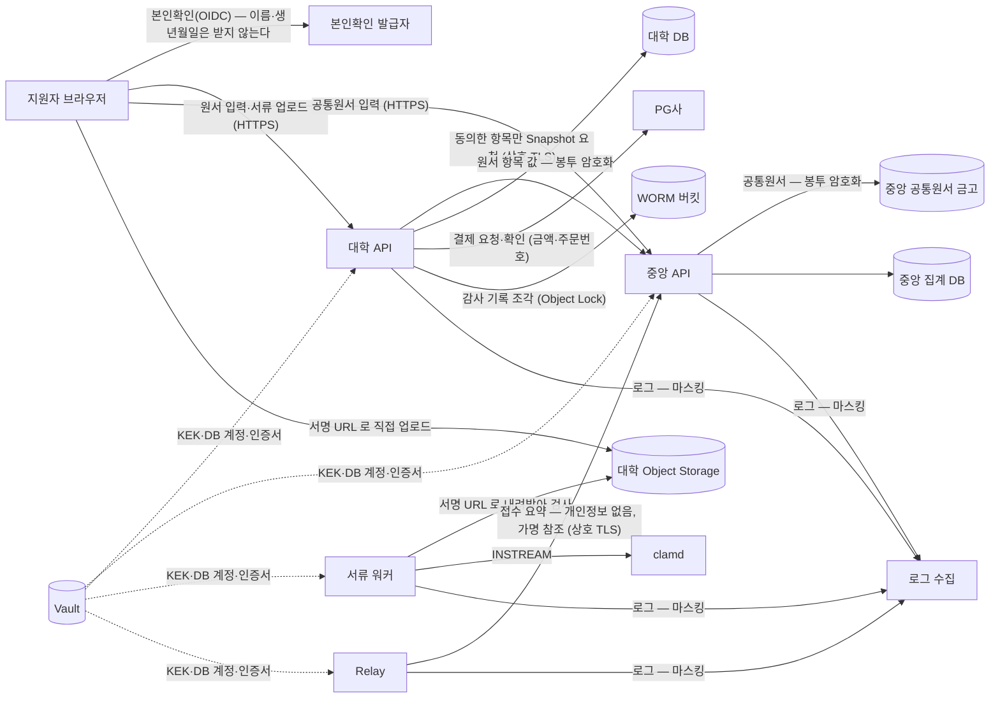

# 개인정보 처리흐름도 — 어디서 받아 어디에 어떻게 두고 누구에게 넘기나

> 기준일: 2026-10-03 · 태스크 **T-M6-11**(v1.0 §17 "위탁·Subprocessor 목록") · 근거: 이 날짜의 코드와 [10-admission-privacy-and-legal-notices.md](10-admission-privacy-and-legal-notices.md)(법적 역할·동의·고지)
>
> 이 문서는 **구현이 실제로 하는 일**을 적는다. 법적 판단(처리자·위탁 관계·동의 문안)은 문서 10 과 법무·대학이 정한다.
> 코드가 바뀌면 이 문서도 같이 고친다. 표의 "근거" 는 그 동작을 하는 파일이다.

## 1. 흐름

## 2. 저장소별 — 무엇을 어떻게 두나

| 저장소 | 담는 개인정보 | 보호 | 보존 | 근거 |
|---|---|---|---|---|
| 대학 DB `application_field_value` | 원서 항목 값 전부(공통원서 Snapshot 의 연락처·학교, 자기소개, 성적 등) | **봉투 암호화** — 원서마다 DEK, KEK 는 Vault Transit `pii-<대학>`. 원서·항목에 묶어 옮겨 붙이면 풀리지 않는다 | 대학 보존 규칙(문서 10) | `common/db/field-cipher.ts`, D-70 |
| 대학 DB `applicant` | 가명 토큰(`subject_token`)만 — 실명·주민번호 없음(`pii_key_version='none'`) | 앱 역할 최소 권한 | 〃 | `common/identity/oidc-auth.ts` |
| 대학 DB `audit_event` | 행위자 ID(담당자)·IP **해시**·요청번호. 원서 값은 남기지 않는다 | 추가 전용 트리거·hash-chain·WORM 조각 | WORM 5년(설정) | `modules/audit/*`, D-41·D-62·D-75 |
| 대학 DB `outbox_event`·보관 표 | 접수 요약(상태·전형·모집단위 이름, 가명 참조) | 13개월 지나면 파티션째 삭제 | 13개월 | `common/outbox/outbox-archive.ts`, D-74 |
| 대학 Object Storage | 제출 서류 원본(PDF·JPG·PNG) | 버킷 비공개, 서명 URL(짧은 수명), 악성코드 검사 | 대학 보존 규칙 | `modules/document/*` |
| WORM 버킷 | 감사 기록 조각(위와 같음 — 원서 값 없음) | Object Lock COMPLIANCE — 보관 중 삭제·수정 불가 | 5년 | `audit-worm.ts` |
| 중앙 공통원서 금고 | 표준 항목(출신 고교·졸업 연도·이메일·휴대전화) | **봉투 암호화** — 공통원서마다 DEK, KEK `pii-central`. 대학별 제공 동의·철회 기록 | 지원자가 지울 때까지 | `profile-vault.service.ts`, D-70 |
| 중앙 집계 DB | 접수 요약 + **목적별 가명 참조**(HMAC, 키는 금고에 없다) — 이름·연락처 없음 | 금고와 스키마·운영 DB 분리 | 운영 규칙 | `purpose-ref.ts`, D-39 |
| 로그 | 요청번호·경로·상태 — 본문·토큰은 남기지 않고 주민번호·전화·이메일·카드 마스킹 | `StructuredLogger`, CI 검사 | 수집 측 규칙 | `check-logging.mjs`, T-M4-24 |
| DB 비상 접속 기록 | 비상 DB 계정 이름·끝나는 시각 | 추가 전용 | DB 와 같음 | `0004_break_glass.sql`, D-72 |
| 대학 DB `support_lookup`(상담 증적) | 상담 담당 ID·문의 분류·그 순간 상담 화면 응답(상태·시각·결제/서류 요약 — 원서 값·연락처·파일 이름 없음). 원서마다 상담 확인번호(`application.support_code`, 가명 번호) | 추가 전용 트리거·응답 해시·원서 감사 체인(`SUPPORT_LOOKUP`) | 원서와 같음 | `modules/support/*`, `0008_support_view.sql`, D-79 |

## 3. 밖으로 나가는 곳 — 위탁·Subprocessor 후보

서버가 부를 수 있는 곳은 출구 허용 목록으로 묶여 있다(`server-kit/egress.ts`, T-M5-07) — 아래 밖으로는 나가지 못한다.

| 받는 곳 | 무엇이 가나 | 누가 부르나 | 비고 |
|---|---|---|---|
| 본인확인 발급자(OIDC — 실 기관은 C 계약) | 로그인·본인확인. 서버는 토큰의 주체(가명)만 받는다 | 브라우저 → 발급자, API 는 공개키만 가져온다 | 문서 12 |
| PG사 | 주문번호·금액·결제 상태 — 원서 내용은 가지 않는다 | 대학 API | 실 PG 는 T-M6-04 |
| CSP(K-PaaS) — 컴퓨팅·DB·Object Storage·Vault | 위 저장소 전부를 호스팅 | — | 수탁자로 공개(문서 10 §5.5) |
| 중앙(원서로 운영 주체) | 공통원서 원본, 접수 요약(가명) | 지원자·Relay·대학 API | 운영 주체·위탁 관계는 문서 10 §2 |
| ClamAV(clamd) | 서류 바이트(검사용, 남기지 않는다) | 서류 워커 | 클러스터 안 서비스 — 외부 전송 없음. 서명 DB 갱신만 바깥(미러 권장) |

## 4. 지원자 권리·파기와 이어지는 곳

- 공통원서 제공 동의는 대학별로 주고 철회할 수 있다 — 철회해도 **이미 만든 원서의 Snapshot 은 대학 원본으로 남는다**(v1.1 §10 §3, 문서 10 §5.2)
- 원서 항목 값은 키를 버리면(DEK 삭제·KEK 폐기) 읽을 수 없게 된다 — 파기 절차에 쓸 수 있다(암호학적 파기). 파기 실행·승인 화면은 아직 없다(문서 04 §7 "보존기간 파기 실행")
- 감사 기록은 WORM 보관 기간 동안 지울 수 없다 — 원서 값은 담지 않으므로 파기 대상과 겹치지 않게 설계했다
